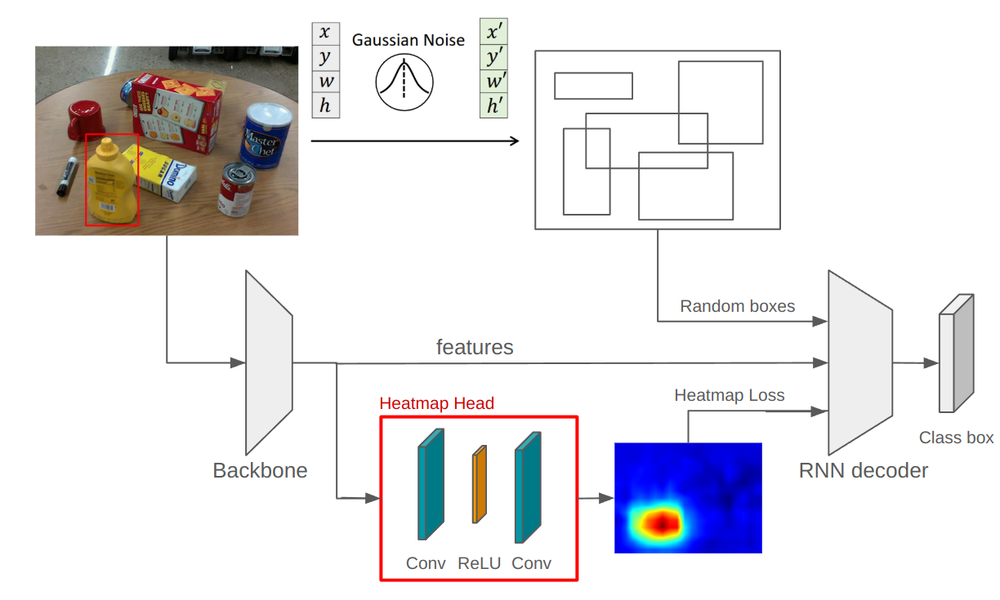
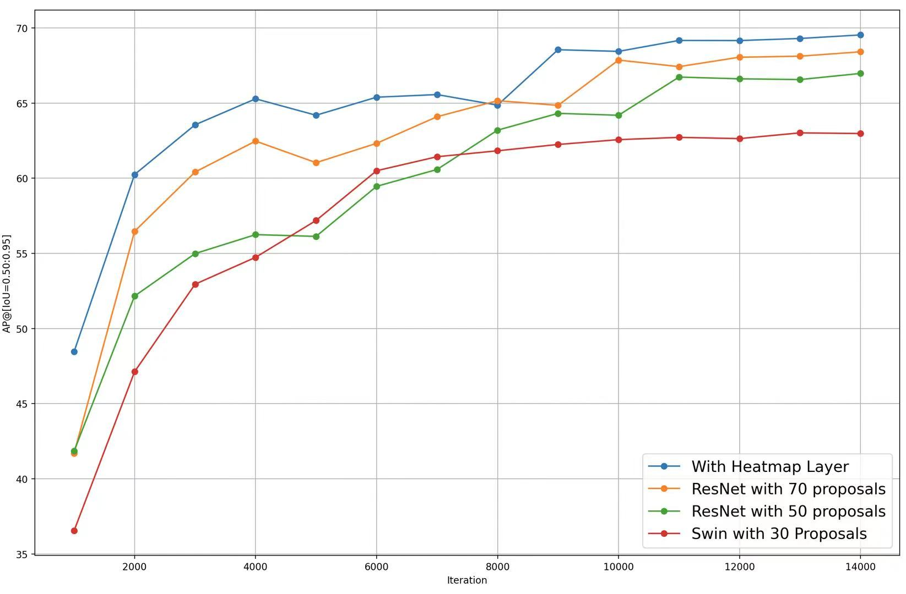
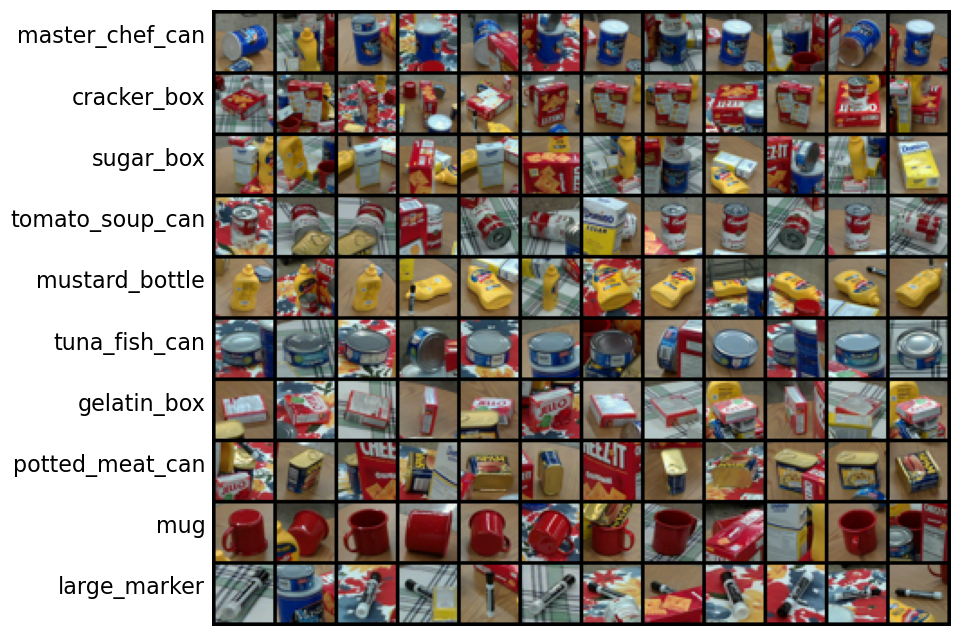

## DiffusionDet: Diffusion Model for Object Detection

**DiffusionDet is the first work of diffusion model for object detection.**


[**Original Paper Information**]
> [**DiffusionDet: Diffusion Model for Object Detection**](https://arxiv.org/abs/2211.09788)               
> [Shoufa Chen](https://www.shoufachen.com/), [Peize Sun](https://peizesun.github.io/), [Yibing Song](https://ybsong00.github.io/), [Ping Luo](http://luoping.me/)                 
> *[arXiv 2211.09788](https://arxiv.org/abs/2211.09788)* 

# Our Model
[**Structure**]

We proposed a heatmap head to accelerate training and improve the model's performance on small&occluded objects, here are our experiment results:

# Our Dataset

Our dataset can be accessed at [dataset](https://drive.google.com/file/d/1gltFSYszf5kGjKHXin1RVSsUee1dccLr/view?usp=drive_link), this dataset contains 10 object categories with 2.5K training images and 2.5K validation images. Each image in the dataset is a 640x480 RGB color image. All images in the validation set are taken from scenes not represented in the training set. We retrained DiffusionDet on this dataset to test the model's robustness.

To use the dataset,
```bash
mkdir datasets

unzip PROPS-Detection-Dataset.zip

cd ..
```
## Getting Started
1. Prepare Detectron2 Framework: https://github.com/facebookresearch/detectron2/blob/main/INSTALL.md#installation.

2. Prepare Pretrain Models

DiffusionDet uses three backbones including ResNet-50, ResNet-101 and Swin-Base. The pretrained ResNet-50 model can be
downloaded automatically by Detectron2. We also provide pretrained
[ResNet-101](https://github.com/ShoufaChen/DiffusionDet/releases/download/v0.1/torchvision-R-101.pkl) and
[Swin-Base](https://github.com/ShoufaChen/DiffusionDet/releases/download/v0.1/swin_base_patch4_window7_224_22k.pkl) which are compatible with
Detectron2. Please download them to `DiffusionDet_ROOT/models/` before training:

```bash
mkdir models
cd models
# ResNet-101
wget https://github.com/ShoufaChen/DiffusionDet/releases/download/v0.1/torchvision-R-101.pkl

# Swin-Base
wget https://github.com/ShoufaChen/DiffusionDet/releases/download/v0.1/swin_base_patch4_window7_224_22k.pkl

cd ..
```
3. Train the Model
```bash
python train_net.py --num-gpus 1 \
    --config-file configs/diffdet.props.res50.yaml
```
Our preset parameters:[props-yaml](configs/diffdet.props.res50.yaml)

4. Visualization

To visualize inference results on some pictures, run
```bash
python visualize_results.py 

#Visulize loss curve

python loss_vis.py 
```

## Citing DiffusionDet

If you found our work helpful, consider citing us with the following BibTeX reference:

```BibTeX
@article{YuDiffusionDetHeatMap,
      title={Convergence Acceleration For DiffusionDet: On PROPS Dataset},
      author={Yu, Gongxing and Sun, Liangkun and Lyu, Yang},
      year={2025}
}
```
